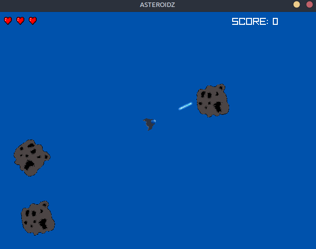
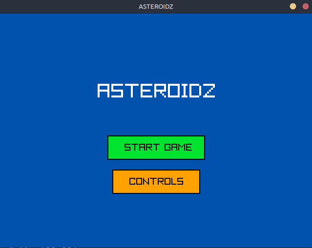
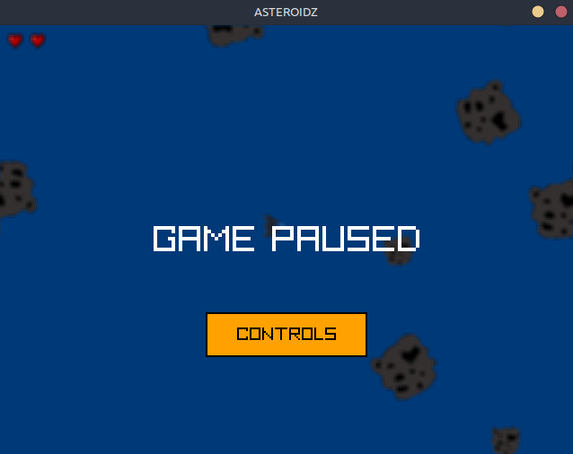
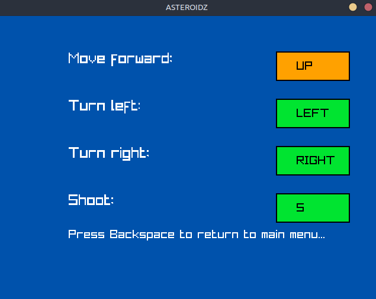

```           
  ___      _                 _     _     
 / _ \    | |               (_)   | |    
/ /_\ \___| |_ ___ _ __ ___  _  __| |____
|  _  / __| __/ _ \ '__/ _ \| |/ _` |_  /
| | | \__ \ ||  __/ | | (_) | | (_| |/ / 
\_| |_/___/\__\___|_|  \___/|_|\__,_/___|
```

[](https://app.codacy.com/gh/matf-pp/2026_Asteroidz/dashboard?utm_source=gh&utm_medium=referral&utm_content=&utm_campaign=Badge_grade)

Klon igrice Asteroids napisan u programskom jeziku Rust korišćenjem Raylib biblioteke.

<p align="center">
  
</p>
<p align="center">
  
  
</p>
Podrazumevane kontrole:  

|       Akcija     | taster |  
| :--------------: | :----: |  
| Napred           |   ↑    |  
| Okreni ulevo     |   ←    |  
| Okreni udesno    |   →    |  
| Ispali projektil |   s    | 

Ove kontrole se mogu menjati preko sledećeg menija:  
<p align="center">  
  
</p>

## Tehnologije
- [Rust](https://rust-lang.org/)
- [raylib-rs](https://github.com/deltaphc/raylib-rs)
- [Cargo](https://crates.io/)

## Korišćeni alati
- [Gimp](https://www.gimp.org/)
- [Piskel](https://www.piskelapp.com/)

## Prevođenje i pokretanje

Projekat koristi Cargo alat za upravljanje paketima i prevođenje programa.

Komanda za prevođenje projekta:
```
cargo build --release
```

Komanda za pokretanje projekta:
```
cargo run --release
```

## Operativni sistem

Projekat je razvijan za Linux operativni sistem.

Moguće je prevođenje programa za Windows operativni sistem, ali razvoj i testiranje na toj platformi nisu vršeni.

## Autori
- Filip Jevtović 36/2023
- Nikola Lazić 11/2023
- Ljubomir Banović 24/2023

## Licensa
Ovaj projekat je licensiran pod **GNU General Public License v3.0**.
Pogledaj [LICENSE](LICENSE) fajl za detalje.

## Korišćeni resursi
  - heart.png from: https://opengameart.org/content/heart-pixel-art
  - "Space Jazz" Kevin MacLeod (incompetech.com)
    Licensed under Creative Commons: By Attribution 4.0 License 
    http://creativecommons.org/licenses/by/4.0/
  - impact.wav: `291299-metalsheetlarge128.wav` by Soundsnap via [OpenGameArt.org](https://opengameart.org) - Licensed under [GNU GPL 3.0](https://www.gnu.org/licenses/gpl-3.0.html)
  - break.wav: `rock_breaking.flac` by Blender Foundation (submitted by Lamoot) via [OpenGameArt.org](https://opengameart.org/content/rockbreaking) - Licensed under [CC BY 3.0](https://creativecommons.org/licenses/by/3.0/)
